# Vue 3 全家桶实践

> 使用 vite 创建一个 Vue 3 项目，并实践 vue-router4、vuex4 结合 Composition API 的使用。

## 1. 使用 vite 创建 Vue3 项目

- ### 创建  
  运行命令行 `yarn create vite-app vue3-demo` 创建一个 `Vue 3` 应用 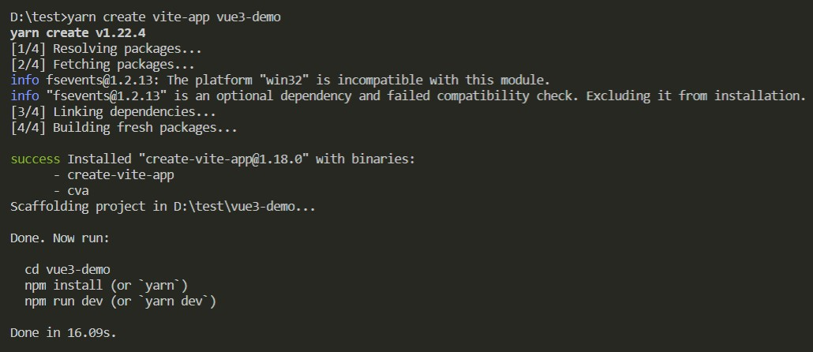

- ### 创建成功后，文件结构如下  
  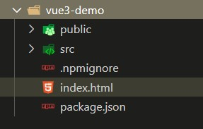

- ### run 起来  
  `cd vue3-demo` -> `yarn` -> `yarn dev` 就跑起来了一个 Vue 3 应用
  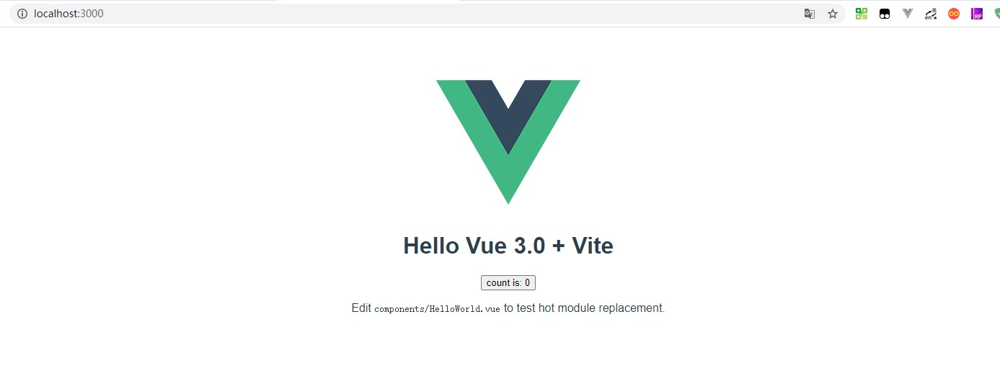

- ### `Vue 3 API` 的使用  
  Vue 3 中暴露的 API 与 Vue 2 有所不同，使用方式如下  
  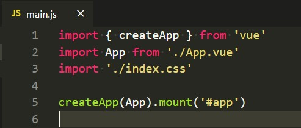

## 2. vue-router 4 结合 Compostion API 使用实践
vue-router 4 API 相对于之前也有一些区别，使用方式也有不同

- ### 安装 `yarn add vue-router@next`  
  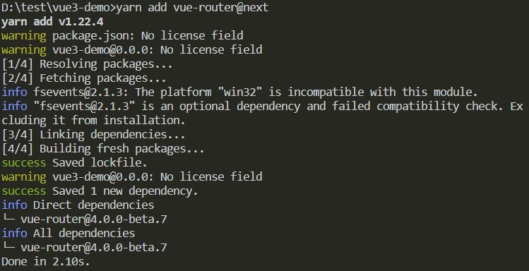

- ### 使用 `vue-router`  
  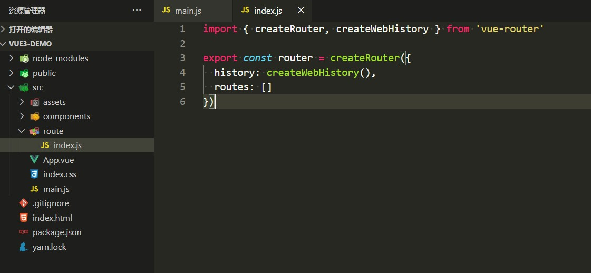

- ### 挂载到 `vue` 上  
  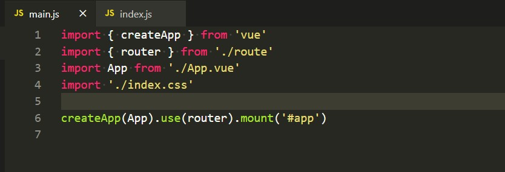

- ### 结合 `Composition API` 使用 `vue-router`  
  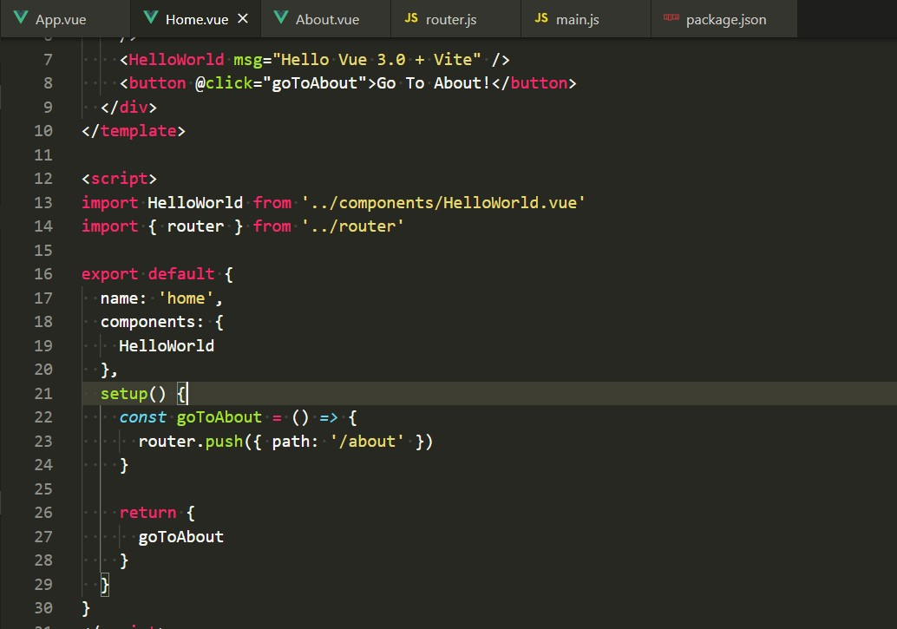

- ### 当前路由的值  
    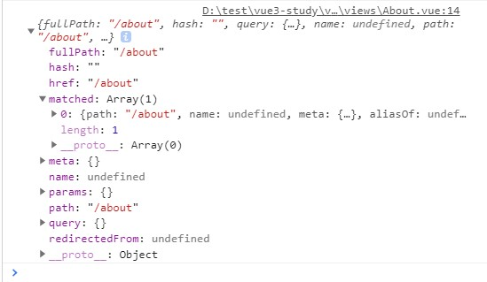

## 3. vuex 4 结合 Compostion API 使用实践

- ### 安装 `yarn add vuex@next`  
  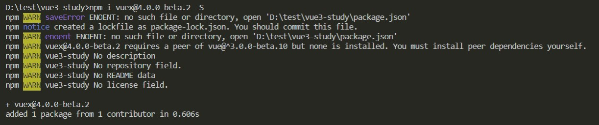

- ### 使用 `vuex`  
  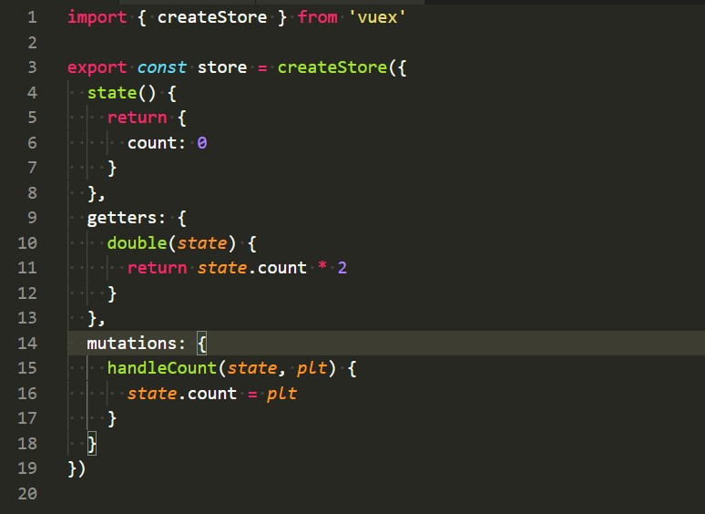

- ### 挂载到 `vue` 上  
  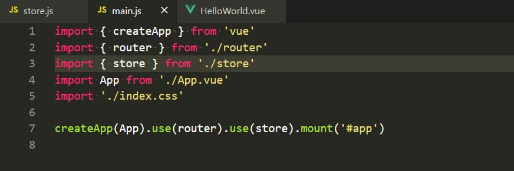

- ### 结合 `Composition API` 使用 `vuex`  
  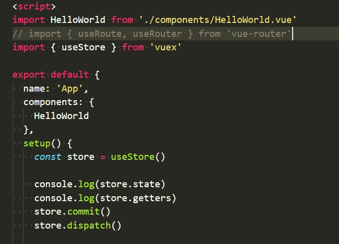

## 4. UI 框架
目前 `Element UI` `Ant-Design-Vue` 等框架在做 Vue 3 的适配

## 参考
- [vue-next](https://github.com/vuejs/vue-next)  
- [vite](https://github.com/vitejs/vite)  
- [vuex](https://github.com/vuejs/vuex/tree/4.0)  
- [vue-router](https://github.com/vuejs/vue-router-next)