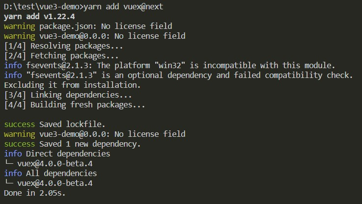
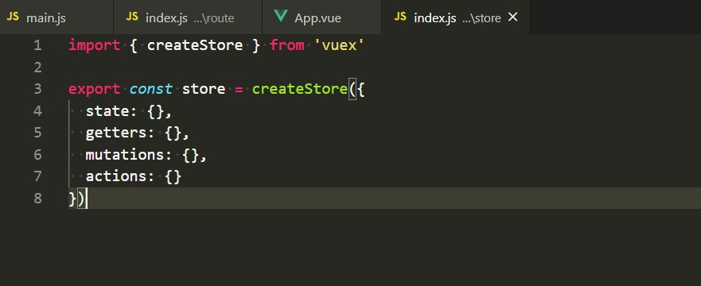
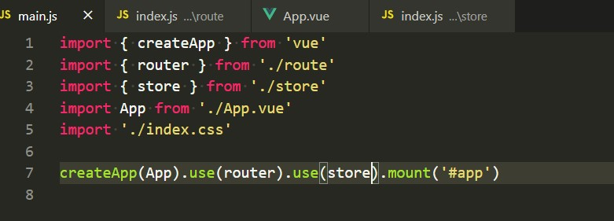

# Vue3 实践

> 使用 vite 创建一个 Vue3 项目，并实践 vue-router4、vuex4 结合 Composition API 的使用。

## 1. 使用 vite 创建 Vue3 项目

- 创建  
  运行命令行 `npm init vite-app vue3-demo` 创建一个 `vue3` 应用 

- 文件结构  
  成功之后是这样婶儿的  

- run 起来  
  然后 `cd vue3-demo` -> `npm install` -> `npm run dev` 就跑起来了一个 vue3 应用

- `vue3 API` 的使用  
  vue3 中暴露的 API 与 vue2 有不同，使用方式有一些区别 

## 2. vue-router4 结合 Compostion API 使用实践

vue-router4 API 相对于之前也有一些区别，使用方式也有不同。

- 安装 `npm i -S vue-router@4.0.0-alpha.12` 

- 使用 `vue-router` 

- 挂载到 `vue` 上 

- 结合 `Composition API` 使用 `vue-router`
  - push 
  - 当前路由 
  - 当前路由的值  
    

## 3. vuex4 结合 Compostion API 使用实践

- 安装 `npm i vuex@4.0.0-beta.2 -S` 

- 使用 `vuex` 

- 挂载到 `vue` 上 

- 结合 `Composition API` 使用 `vuex` 

## 参考
- [vue-next](https://github.com/vuejs/vue-next)  
- [vite](https://github.com/vitejs/vite)  
- [vuex](https://github.com/vuejs/vuex/tree/4.0)  
- [vue-router](https://github.com/vuejs/vue-router-next)