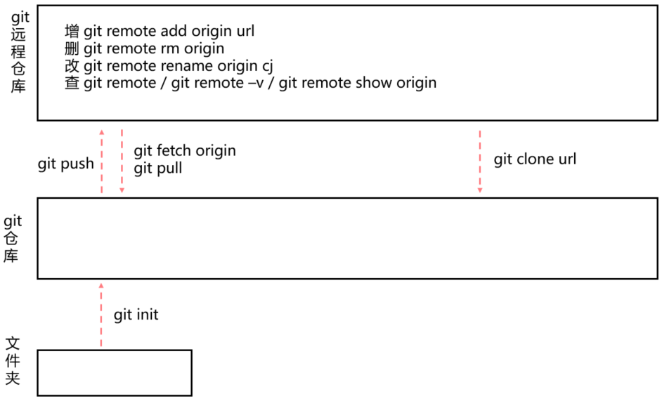
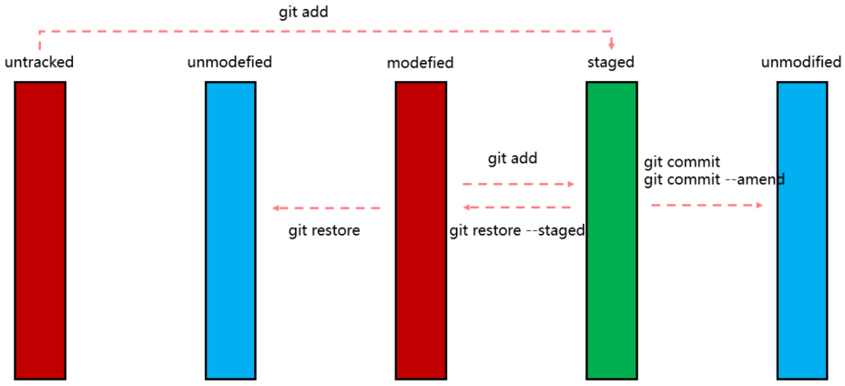
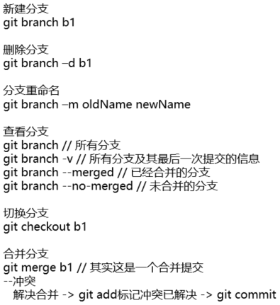
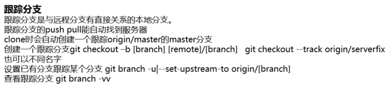

# 常金的 Git 学习总结

## 前言
前段时间进入新公司，开始使用 Git 作为版本控制工具。遂对 Git 基础进行了一定的学习，这里是我的一些学习总结。主要是命令太多，需要理解记忆比较好，这里总结一下，希望对大家有一些帮助。

## Git 理解
### 版本控制系统发展
版本控制系统的发展过程，大致沿着 VCS（Version Control System，版本控制系统） -> CVCS（Centralized Version Control Systems，集中式版本控制系统） -> DVCS（Distributed Version Control System，分布式版本控制系统）前进。

常用版本控制系统中，SVN 是 CVCS 的一个代表，Git 是 DVSC 的一个代表。  

DVCS 由于其安全，灵活等优点，逐渐成为版本控制系统领域的最佳实践，Git 更是成为了版本控制系统的事实标准，所以学习 Git 很有必要。  

### Git 命令理解
Git 强大的命令系统给我们带了很大的便利，很灵活，很好用。但是对初学者不是很友好。（几十个命名，要搞死人啦）  

这里对这些 Git 命令做个分类，好记一些。大致分为 4 类。
1. Git 仓库相关命令。
   1. git init
   2. git clone
   3. git remote
   4. git push
   5. git pull
   6. git fetch
2. Git 工作流相关命令。
   1. git add
   2. git commit
   3. git restore
   4. git status
3. Git 分支相关命令
   1. git branch
   2. git checkout
   3. git merge
   4. git rebase
4. 其他命令
   1. git config 配置
   2. git help
   3. git diff
   4. git log
   5. git rm
   6. git mv
   7. git tag

## Git 仓库
Git 更像是一个小型的文件系统，提供了许多以此为基础构建的超强工具，而不只是一个简单的 VCS。
1. Git 仓库  
学习 Git，第一个要理解的概念就是 Git 仓库。Git 仓库说着很神秘，其实就是一个被 Git 管理的文件夹。  
Git 仓库存在一个隐藏的 `.git` 文件夹，`.git` 内部存放版本控制相关的文件。当我们切换分支或版本时，Git 会自动拉取对应的文件，展示到文件夹中；当我们提交一些文件时，Git 会把相关的提交做一定的处理，存到 `.git` 中。  

2. Git 远程仓库  
   刚接触 Git 的人，有时会迷失在 Git 仓库、Git 远程仓库、GitHub 这些名词中。  
   其实，通俗的解释，Git 远程仓库也就是一个普通的 Git 仓库罢了，只是这个仓库放在某个远程服务器上。Git 作为一个分布式的版本控制系统，本地和远程仓库都是一样的。至于 GitHub，是一个 Git 仓库托管网站，大家的远程仓库放到他的服务器上。

3. 本地文件夹、Git 仓库、Git 远程仓库之间的关系
  
  图中大概介绍了三者的关系。

4. 仓库相关命令记忆  
   * 建立本地仓库：  
     `git init` 本地文件夹 -> Git 仓库；  
     `git clone` 克隆远程仓库到本地。  
   * 操作远程仓库 `git remote`：remote 命令通过不同的参数实现不用的功能。可以理解为增删改查
     * add：连接本地仓库和远程仓库
     * rm：断开关联
     * rename：重命名远程仓库在本地的 name
     * 无参数/-v/show origin：查看远程仓库相关信息
   * 本地 Git 仓库和远程仓库交互 `git push、git pull、git fetch`：
     * push：推送本地提交到远程
     * pull：从远程拉数据
     * fetch：也是从远程拉数据，但是 fetch 只是从远程仓库拉数据，不会自动合并数据到本地仓库。详见[远程仓库的使用 - 从远程仓库中抓取与拉取](https://www.progit.cn/#_remote_repos)

## Git 工作流
Git 使用中，一般操作方式大致为 修改 -> 暂存 -> 提交。形成一个工作流。  

1. Git 仓库中文件常见 4 种状态
   1. untracked 新添加到 Git 仓库中的文件会被标识为未追踪状态。
   2. unmodefied 未修改状态，`git clone` 下来的文件，初始为未修改状态；commit 命令提交过的文件也为未修改状态。
   3. modefied 已修改状态，当文件被修改后，文件会被标识为已修改状态。
   4. staged 已暂存状态，通过 `git add` 命令暂存后的文件会标识为已暂存状态。

   使用 `git status` 查看文件状态
2. `git add`  
   add 命令一般来说有三种使用场景
   1. 跟踪新文件
   2. 暂存已修改文件
   3. 合并时把冲突的文件标记为已解决状态

   总的来说，其实就是“把文件添加到暂存中，等待提交”

3. `git commit`  
   commit 命令用来提交一个版本，提交完成之后，就会有一个版本存在 Git 仓库中。  
   
   这里有一篇文章可以帮助理解 Git commit 的内部原理。[这才是真正的Git——Git内部原理揭秘！](https://zhuanlan.zhihu.com/p/96631135)
4. 撤销相关  
   Git 操作过程中，会存在一些撤销操作的情况。  
   常用的命令就是 `git restore [file]` 直接调用这条命令可以撤销对文件的修改；  
   如果需要撤销已暂存的修改，需要添加 --staged 参数 `git restore --staged [file]`；  
   另外 `git commit --amend` 指令用来修改上次提交，如果自上次提交以来未做任何修改，则修改的只是提交信息；  
   另外还有版本回退的情况，可以使用 `git reset` 命令

## Git 分支
如果日常自己使用 Git 的话，了解 Git 仓库、Git 工作流相关命令基本就能满足需求。实际开发工作中还要用到分支。
1. 分支的理解  
   摘录：[Pro Git - 分支简介](https://www.progit.cn/#_git_branches_overview)  
   常金：多读几遍 Pro Git 上的这段介绍，结合参考资料中的*怎么理解 git 的快照*细细品味吧
2. `git branch`  
   分支命令总结：依然是增删改查 多一个切换 合并 变基  
   
3. 远程分支、跟踪分支  
   摘录：[Pro Git - 远程分支](https://www.progit.cn/#_remote_branches)  
   常金：
   
4. 分支流水线及特性分支  
   摘录：阅读 Pro Git 中，这一节[分支开发工作流](https://www.progit.cn/#_%E5%88%86%E6%94%AF%E5%BC%80%E5%8F%91%E5%B7%A5%E4%BD%9C%E6%B5%81)，了解更多。  
   常金：平常开发中常常会遇到 `master`、`develop`、`hotfix-xx`、`feature-xxx` 这种命名的分支。其实这只是一种约定俗成，  
   master 一般作为主分支，其代码一般较为稳定用来发布到生产环境；  
   develop 一般作为开发分支，开发完成的某个功能，合并到develop分支上，一般对应到测试环境；  
   feature-xx 分支，开发某些特定功能时使用；  
   hotfix-xx 分支一般解决某些 BUG 时使用，解决后直接合并到 master 分支，发布到生产；  
   另外还有一些公司会用到 release 分支等，其实也是公司内部的约定，不同公司情况不尽相同，不过大概意思都是差不多的。
5. 变基  
   摘录：[变基](https://www.progit.cn/#_rebasing)  
   常金：重点就是一句话。变基的原理：提取差异，目标分支上重新应用差异

## Git 其他命令
Git 的其他命令一般不是很常用，理解上边的三部分就够日常开发使用了；自己尝试使用下看下效果。

参考资料  
[1] [Pro Git](https://www.progit.cn/#_pro_git)  
[2] [如何理解git的快照？](https://www.zhihu.com/question/27680108/answer/156748005)